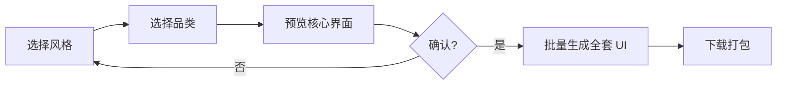
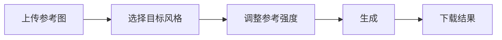
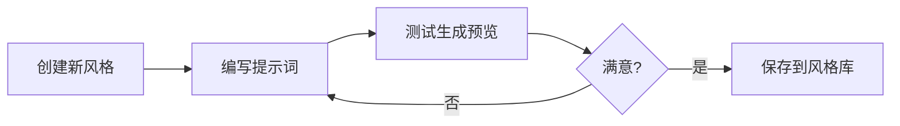

# 游戏美术生图工作室工作流

> 本文档描述游戏美术生图系统的完整工作流程、技术架构和使用方法。

---

## 功能模块总览

| 模块        | 路由               | 功能                |
| ----------- | ------------------ | ------------------- |
| 工作室主页  | `/studio`          | 模型广场 + 工具入口 |
| 工具工作区  | `/studio/[toolId]` | 11 种图像处理工具   |
| UI 套件生成 | `/studio/kit`      | 一键生成完整游戏 UI |
| 自定义风格  | `/studio/custom`   | 创建/管理专属风格   |
| 图生图      | `/studio/img2img`  | 参考图风格迁移      |
| 风格融合    | `/studio/fusion`   | 多风格混合          |

---

## 核心工作流

### 1. UI 套件生成流程



**数据流：**

- 风格模板 → `lib/data/style-templates.ts`
- 品类模板 → `lib/data/genre-templates.ts`
- API 调用 → `/api/generate-image`

### 2. 图生图流程



### 3. 自定义风格流程



---

## API 接口

### POST /api/generate-image

**请求参数：**

```json
{
  "prompt": "提示词",
  "negativePrompt": "负面提示词（可选）",
  "size": "2K"
}
```

**尺寸选项：** `2K` | `4K` | `1:1` | `16:9` | `9:16`

**响应：**

```json
{
  "success": true,
  "images": ["https://..."],
  "model": "doubao-seedream-4-5-251128",
  "usage": { "generated_images": 1 }
}
```

---

## 数据模板结构

### 风格模板 (StyleTemplate)

```typescript
{
  id: 'cute-q',
  name: 'Q版可爱',
  basePrompt: '核心视觉描述...',
  negativePrompt: '排除元素...',
  keywords: ['圆润', '高饱和'],
  colorPalette: ['#FF6B9D', ...],
  coverGradient: 'from-pink-400 to-orange-300',
}
```

### 品类模板 (GenreTemplate)

```typescript
{
  id: 'match3',
  name: '三消游戏',
  screens: [
    {
      id: 'match3-board',
      name: '游戏棋盘',
      promptTemplate: '三消游戏核心界面 {style}...',
      isCore: true,
    },
    ...COMMON_SCREENS,
  ],
}
```

---

## 文件结构

```
web/
├── app/
│   ├── api/generate-image/    # 生图 API
│   └── studio/
│       ├── page.tsx           # 主页
│       ├── [toolId]/          # 工具工作区
│       ├── kit/               # UI 套件
│       │   ├── page.tsx       # Phase 1
│       │   └── generate/      # Phase 2
│       ├── custom/            # 自定义风格
│       ├── img2img/           # 图生图
│       └── fusion/            # 风格融合
├── lib/
│   ├── api/image-gen.ts       # API 抽象
│   ├── data/
│   │   ├── style-templates.ts # 8种风格
│   │   └── genre-templates.ts # 5种品类
│   └── stores/studio-store.ts # 状态管理
└── docs/
    ├── TEMPLATE_GUIDE.md      # 模板编辑指南
    └── STUDIO_WORKFLOW.md     # 本文档
```

---

## 环境配置

`.env.local` 需配置：

```
API_302_KEY=sk-xxxxx
```
